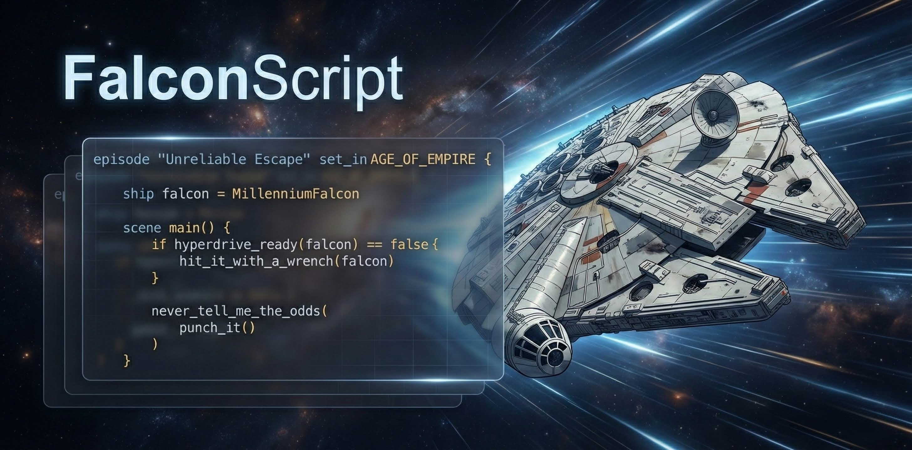

# FalconScript

FalconScript is a canon-aware programming language for modeling unreliable systems,
improbable escapes, and narrative-driven control flow.

It features deterministic syntax, nondeterministic outcomes, era-sensitive semantics, and a hyperdrive that fails exactly when it’s least convenient.

FalconScript is designed for developers who build systems that must function under uncertain causality, degraded hardware, conflicting prophecies, and overwhelming odds.



---

## Why FalconScript

Modern programming languages assume:
- Hardware reliability
- Predictable causality
- Rational decision-making
- Stable timelines

FalconScript assumes none of these.

FalconScript models systems the way they actually behave:
- Things break under pressure
- Plans degrade at runtime
- Confidence alters outcomes
- Critical fixes occur only after physical intimidation
- Some failures are required for eventual success

If your system must work *despite itself*, FalconScript is appropriate.

---

## Core Concepts

- **Canon-aware execution**
  Code behavior changes based on declared era and canon constraints.

- **Narrative-driven control flow**
  Outcomes are influenced by confidence, timing, and dramatic necessity.

- **Lore as a standard library**
  Quotes, archetypes, ships, and historical events are language primitives.

- **Plot devices as first-class constructs**
  Prophecy, retcons, and improbable survivability are explicitly modeled.

- **Deterministic syntax, nondeterministic runtime**
  The compiler is strict. Reality is not.

---

## Example

```falcon
episode "Never Tell Me The Odds" set_in AGE_OF_EMPIRE {

    ship falcon = MillenniumFalcon

    scene escape() {
        if hyperdrive_ready(falcon) == false {
            HanSolo.mutter("She may not look like much...")
            hit_it_with_a_wrench(falcon)
        }

        never_tell_me_the_odds(
            punch_it()
        )
    }
}
````

---

## Project Status

FalconScript is under active development.
The language specification is stabilizing.
The runtime is unreliable by design.

Contributions are welcome.

---

## Getting Started

* Read `docs/language-spec.md`
* Review `docs/standard-library.md`
* Start with `examples/escape.falcon`
* Do not trust the odds calculator

---

## License

FalconScript is released under a permissive open-source license.
See `LICENSE` for details.
